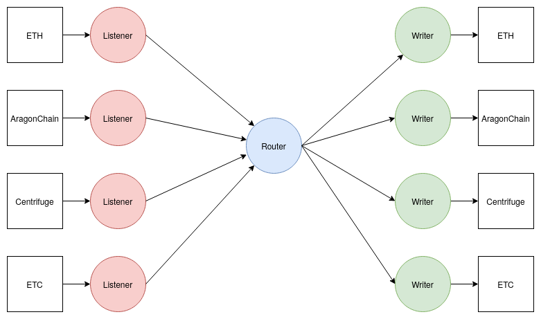

# 🌉 <b> Overview </b>

## Getting started

If you looking for a simple way to try bridge in action, please visit the page - [Running Locally](local.md)

## Summary

At a high level, ChainBridge is a message passing protocol. Events on a source chain are used to create a message that is then delivered to the destination chain. We define the concept of a Listener to extract events from a chain and construct a message, and a Writer to interpret messages and submit transactions to a chain. 

## Relevant repos

### [ChainSafe/ChainBridge](https://github.com/ChainSafe/ChainBridge)
This is the original repository of the core bridging software that Relayers run between chains.

### [wintexpro/DOTON](https://github.com/wintexpro/doton-bridge)
This is a fork of the original repository to which the functionality of interacting with the TON node was added. and some additional business logic.
    
### [wintexpro/doton-substrate](https://github.com/wintexpro/doton-substrate)
A substrate pallet that can be integrated into a chain, as well as an example pallet to demonstrate passing simple message between TON and Substrate chains.

### [wintexpro/doton-substrate-chain](https://github.com/wintexpro/doton-substrate-chain)
A simple substrate chain for testing and demo purposes.

### [wintexpro/chainbridge-utils](https://github.com/wintexpro/chainbridge-utils)
A collection of packages used by the core bridging software. This repository is a fork from ChainSafe/chainbridge-utils to which the TON specifically functions were added.
